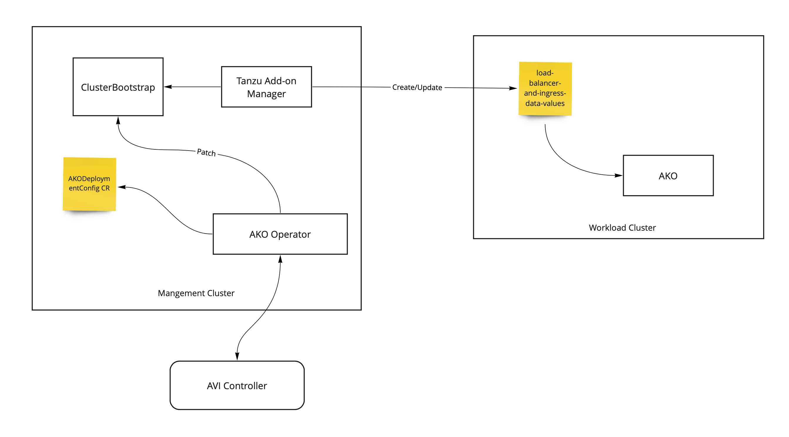

# Design changes made for Cluster-Bootstrap AKO reconciliation

- GoLang version updated from 1.16 to 1.17
- No longer using proxy to resolve gomod dependencies



## Design

- AKO Operator will be a composite package to be deployed in the management cluster
- AKO Operator updates ClusterBootstrap with AKO packages
- Tanzu addon manager will create data-values

## Sequence of Operations

The ClusterBootstrap reconciler leverages the AKO addon-secret reconciled prior by
the AKODeploymentConfigReconciler as well as the available AKO package to patch the ClusterBootstrap's
additional packages with a compatible AKO ClusterBootstrapPackage.

1. Get the cluster's ClusterBootstrap object using the cluster reconciler
2. Get the available AKO package using the cluster reconciler
3. Create a ClusterBootstrapPackage object using the AKO package and AKO addon-secret
4. Patch the ClusterBootstrap's additional packages with the ClusterBootstrapPackage

## Example ClusterBootstrap yaml file

```
apiVersion: run.tanzu.vmware.com/v1alpha3
kind: ClusterBootstrap
metadata:
   name: my-cluster
   namespace: my-ns
spec:
   kapp:
      refName: kapp-controller.tanzu.vmware.com.0.30.3
      valuesFrom:
         providerRef:
            apiGroup: run.tanzu.vmware.com
            kind: KappControllerConfig
            name: test-cluster-tcbt-2-kapp-controller-config
   additionalPackages:
      - refName: foobar1.example.com.1.17.2
        valuesFrom:
           secretRef: foobar2secret
   cni:
      refName: antrea.tanzu.vmware.com.1.2.3--vmware.1-tkg.1
      valuesFrom:
         providerRef:
            apiGroup: cni.tanzu.vmware.com
            kind: AntreaConfig
            name: test-cluster-tcbt-2
```