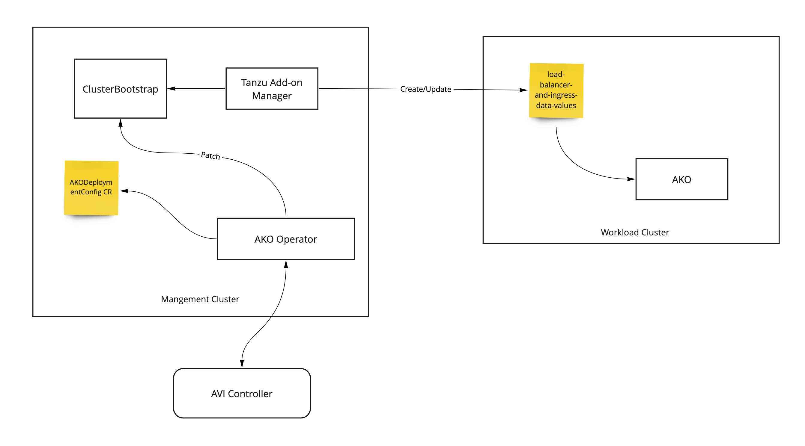

# Design changes made for Cluster-Bootstrap AKO reconciliation

- GoLang version updated from 1.16 to 1.17
- No longer using proxy to resolve gomod dependencies

## Design

- AKO Operator will be a composite package to be deployed in the management cluster
- AKO Operator updates ClusterBootstrap with AKO packages
- Tanzu addon manager will create data-values
